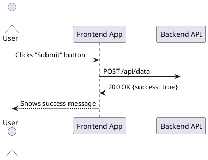
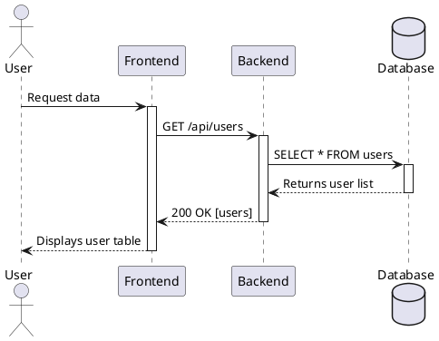
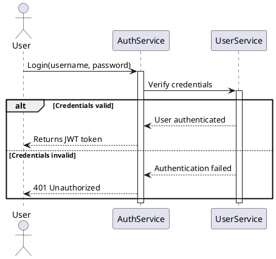
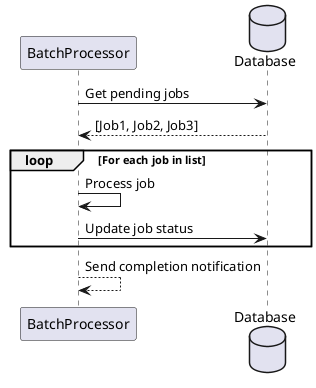
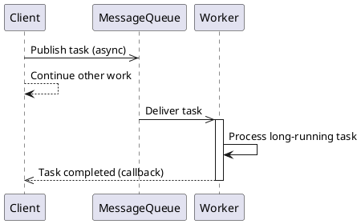
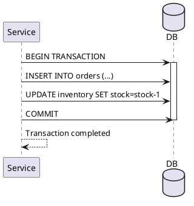
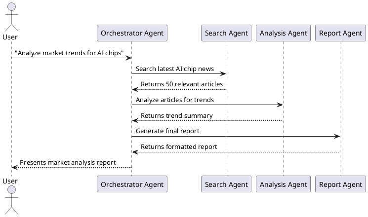
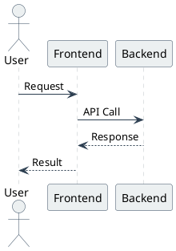
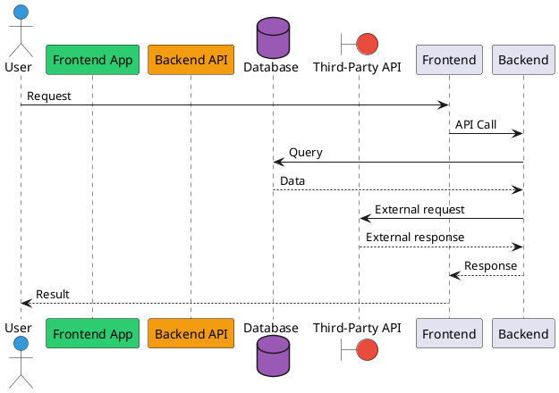

# PlantUML Sequence Diagram Skill

You now have expertise in creating professional, syntactically correct sequence diagrams using PlantUML. Follow these workflows to generate clean, readable diagrams that can be rendered in any PlantUML-compatible tool.

## Basic Sequence Diagrams

**Option 1: Simple 3-party interaction (most common)**


**Option 2: With activation bars (show object lifecycle)**


## Advanced Sequence Diagrams

**Option 1: Conditional logic (alt/else)**


**Option 2: Loops (repeat operations)**


**Option 3: Asynchronous calls & callbacks**


## Common Patterns

**Option 1: Error handling with exceptions**
```plantuml
@startuml Error Handling
participant OrderService
participant PaymentService
participant InventoryService

OrderService -> PaymentService: Process payment($100)
activate PaymentService

try
    PaymentService -> InventoryService: Check stock
    InventoryService --> PaymentService: Stock available
    PaymentService --> OrderService: Payment successful
catch PaymentFailed
    PaymentService --> OrderService: Payment failed - insufficient funds
catch OutOfStock
    PaymentService --> OrderService: Payment failed - item out of stock
end

deactivate PaymentService
@enduml
```

**Option 2: Database transaction flow**


**Option 3: Multi-agent collaboration flow**


## Styling & Customization

**Option 1: Minimal clean style (recommended for documentation)**


**Option 2: Color-coded participants for better readability**


## Key Tools & Renderers

| Tool/Platform | Use Case | How to Access |
|---------------|----------|---------------|
| PlantUML Online Editor | Quick testing and rendering | https://www.plantuml.com/plantuml/ |
| VSCode PlantUML Extension | Local development with live preview | Install from VSCode Marketplace |
| IntelliJ PlantUML Plugin | JetBrains IDE integration | Install from JetBrains Marketplace |
| Markdown Renderers | Embed diagrams in Markdown | GitHub, GitLab, Obsidian, MkDocs |
| Pandoc | Generate diagrams in PDF/Word documents | `pandoc --filter pandoc-plantuml` |

## Best Practices

1. **Keep diagrams focused**: Limit to 5-7 participants and 15-20 interactions per diagram. Split complex flows into multiple smaller diagrams.
2. **Use meaningful names**: Name participants and messages clearly, avoid abbreviations unless they are universally understood.
3. **Use correct arrow types**: `->` for synchronous calls, `-->` for synchronous returns, `->>` for asynchronous calls, `-->>` for asynchronous callbacks.
4. **Show object lifecycle**: Use `activate` and `deactivate` to indicate when objects are processing requests.
5. **Group related logic**: Use `alt` (conditions), `loop` (repetition), `opt` (optional steps), and `par` (parallel execution) blocks to organize complex flows.
6. **Add notes sparingly**: Use `note left of`, `note right of`, or `note over` to explain complex parts without cluttering the diagram.
7. **Test your code**: Always verify that your PlantUML code renders correctly in a compatible tool before sharing.
8. **Follow consistent styling**: Use a consistent color scheme and formatting across all diagrams in a project.

需要我帮你把这个技能文档转换成**可直接复制到Word的标准格式**，或者添加一个**完整的微服务调用链路示例**吗？